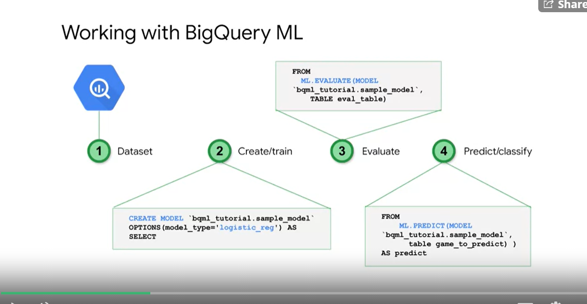
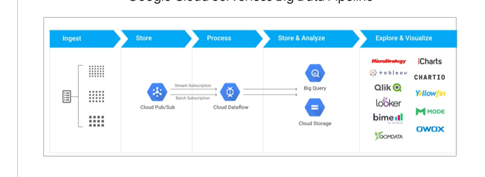

# API 

## Python
[list of python API here](https://cloud.google.com/python/docs/reference)

## Errors

[error codes here ](https://cloud.google.com/apis/design/errors)

# Service Accounts

* if you delete a service acct that you did not create from the IAM roles  page, toss the project its corrupted

* __default Compute Engine service account__ [PROJECT_NUMBER]-compute@developer.gserviceaccount.com

# Cloud Shell

* to set the project 
```bash
gcloud config set project [PROJECT_ID]
```

* to get project id 
```bash
gcloud config get-value project
```

## storage

* to make a storage bucket

```bash
gsutil mb -p [PROJECT NAME] -c [STORAGE CLASS] -l [LOCATION] gs://[NAME ]
```

## Service Accounts

*to create a service acct with its private key
```bash
gcloud config set project [PROJECT ID]

export PROJECT=<your_project_name>

gcloud iam service-accounts create my-account --display-name my-account
gcloud projects add-iam-policy-binding $PROJECT --member=serviceAccount:my-account@$PROJECT.iam.gserviceaccount.com --role=roles/bigquery.admin
gcloud iam service-accounts keys create key.json --iam-account=my-account@$PROJECT.iam.gserviceaccount.com
export GOOGLE_APPLICATION_CREDENTIALS=key.json
```

* to list service accts
```bash
gcloud --project=$PROJECT_ID iam service-accounts list
```

* to enable an API

```bash
gcloud services enable [API NAME]
```

* to create a storage bucket
```bash
gsutil mb gs://[<<BUCKET_NAME(MUST BE UNIQUE)>>]
gsutil mb gs://kubeflow-qwiklabs-gcp-01-1a614bf66a2b
```


## Big Query

* to create a bigquery dataset 
```bash
bq mk --dataset ecommerce 
```

* to list datasets 
```bash
bq ls
```

* to make a table
```bash
bq mk \
--time_partitioning_field timestamp \
--schema [your columne schema here] -t taxirides.realtime
```

## Cloud SQL

* to login to your database cluster
```bash
gcloud sql connect rentals --user=root --quiet
```

## Dataproc

* to create a dataproc cluster
```sql
gcloud dataproc clusters create cluster-dqm01 \
  --region us-central1 \
  --zone us-central1-a \
  --master-machine-type n1-standard-4 \
  --master-boot-disk-size 500 \
  --num-workers 2 \
  --worker-machine-type n1-standard-4 \
  --worker-boot-disk-size 500 \
  --image-version 1.3-deb9 \
  --project xxxxxx \
  --service-account xxxx.iam.gserviceaccount.com

gcloud dataproc clusters create rentals \
  --region us-central1 \
  --zone us-central1-a \
  --master-machine-type n1-standard-4 \
  --master-boot-disk-size 500 \
  --num-workers 2 \
  --worker-machine-type n1-standard-4 \
  --worker-boot-disk-size 500 \
  --image-version 1.3-deb9 \
  --project gcp-data-certification-288008 
```


# Big Query

* can stream data
* pay for stored data 
* for streaming or real-time data, use cloud dataflow

* to create a model



* to parse thise string

- "Adventure|Children|Fantasy"
```sql
CREATE OR REPLACE TABLE
  movies.movielens_movies AS
SELECT
  * REPLACE(SPLIT(genres, "|") AS genres)
FROM
  movies.movielens_movies_raw
```

* to hear all recommendations about a model
```sql
SELECT
  *
FROM
  ML.RECOMMEND(MODEL `cloud-training-prod-bucket.movies.movie_recommender`)
LIMIT 
  100000
```


* to query an item from an array
```sql
    SELECT
      movieId,
      title,
      903 AS userId,
      genres
    FROM
      `movies.movielens_movies`,
      UNNEST(genres) g
    WHERE
      g = 'Comedy' 
```

* to reference a table a previous point in time
```sql
SELECT *
FROM `demos.average_speeds`
FOR SYSTEM_TIME AS OF TIMESTAMP_SUB(CURRENT_TIMESTAMP, INTERVAL 10 MINUTE)
ORDER BY timestamp DESC
LIMIT 100
```

## Big Table

* high performance applications
* __colossus__ where bigtable  stores data
* index with row key
* speed through simple
* nosql database
* you just want a quick scan, sorting = less performance 
* have identical data closer to each other
* if data is read more than others, colusses reorganizes for optimization


# Dataflow

## Dataflow Windowing

* 3 types fixed sliding and session
* in python late data is discarded  in java u can do something about late data

## AutoML 

* csv must be in same bucket as source files
* how long models remain depends on model ttype

* company sells clothes get emails
* model 1, clothes or businnes inquery
  * model 2 pants or shirts
    * model 3 yellow shirts or orange shirts
      * lakers jerseys or golden staten jerseys


### Auto ML Vision

* remove very low frequery level images
* if the target is at 

|target|training data should reflect|
|:------|:------:|
|day|day||
|green room|green room||
|blue item|blue item||
|human presnse|human presence||

* perfect, means not enough variety 

### Auto ML NLP

* topics of items
* max 128 kb 
* models deleted every 6 months

### Auto ML Tables

* import through big query
* 100 g or less
* get data valdiation

# Pub/Sub

 * if your system is down, Pub/Sub holds onto messages for 7 days
 * async and sync publisher
 * dont use for chat apps
 * messages may come out of order
 * only captures data, does not send it to other API
 * Use apache beam for pipelines

* pub sub workflow 




# Data Studio

* users do not see data if they dont have access in bigquery
# Cheatsheats

https://gist.github.com/pydevops/cffbd3c694d599c6ca18342d3625af97


